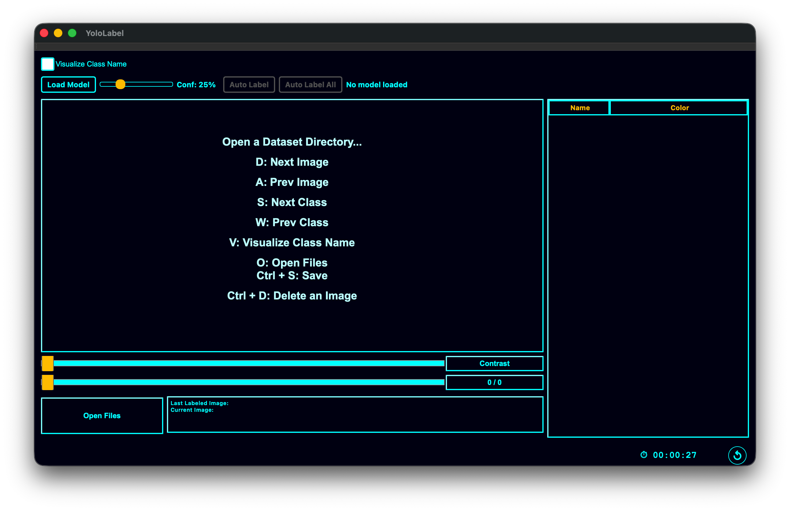

# YOLO-Label

## Sponsors

- AIM(https://www.aimdefence.com/)
<a href="https://www.aimdefence.com/">
 
</a>


## WHAT IS THIS?!
 Reinventing The Wheel?!!!!
 
 

 In the world, there are many good image-labeling tools for object detection. -e.g. , ([Yolo_mark](https://github.com/AlexeyAB/Yolo_mark), [BBox-Label-Tool](https://github.com/puzzledqs/BBox-Label-Tool), [labelImg](https://github.com/tzutalin/labelImg)). 
 
But... I've reinvented one...
 
## WHY DID YOU REINVENT THE WHEEL? ARE YOU STUPID?

 When I used the pre-existing programs to annotate a training set for YOLO V3, I was sooooooooooo bored...
 
 So I thought why it is so boring??

 And I found an answer.
 
 The answer is that pre-existing programs are not **sensitive**.
 
 So I decided to make a **sensitive** image-labeling tool for object detection.
 
 ## SHOW ME YOUR SENSITIVE IMAGE-LABELING TOOL!!

 It's the **SENSITIVE** image-labeling tool for object detection!
 


https://user-images.githubusercontent.com/35001605/211560039-367f27d7-63ab-4342-824e-9f47f2afbc35.mp4


 ## HMM... I SAW THIS DESIGN SOMEWHERE
  I refer to [the website of Joseph Redmon](https://pjreddie.com/darknet/
) who invented the [YOLO](https://www.youtube.com/watch?v=MPU2HistivI).

  
# TUTORIAL / USAGE

## Download

Pre-built binaries are available on the [Releases](https://github.com/developer0hye/Yolo_Label/releases) page.

| OS | Download | Note |
|---|---|---|
| **Windows (x64)** | [YoloLabel-Windows-x64.zip](https://github.com/developer0hye/Yolo_Label/releases/latest/download/YoloLabel-Windows-x64.zip) | Unzip and run `YoloLabel.exe` |
| **Linux (x64)** | [YoloLabel-Linux-x64.AppImage](https://github.com/developer0hye/Yolo_Label/releases/latest/download/YoloLabel-Linux-x64.AppImage) | `chmod +x` and run |
| **macOS (Apple Silicon)** | [YoloLabel-macOS.dmg](https://github.com/developer0hye/Yolo_Label/releases/latest/download/YoloLabel-macOS.dmg) | Open DMG and drag to Applications |

## Install and Run

### For Windows

1. Download [YoloLabel-Windows-x64.zip](https://github.com/developer0hye/Yolo_Label/releases/latest/download/YoloLabel-Windows-x64.zip)

2. Unzip

3. Run YoloLabel.exe


### For Linux

1. Download [YoloLabel-Linux-x64.AppImage](https://github.com/developer0hye/Yolo_Label/releases/latest/download/YoloLabel-Linux-x64.AppImage)

2. Make executable and run
```
chmod +x YoloLabel-Linux-x64.AppImage
./YoloLabel-Linux-x64.AppImage
```

### For macOS

1. Download [YoloLabel-macOS.dmg](https://github.com/developer0hye/Yolo_Label/releases/latest/download/YoloLabel-macOS.dmg)

2. Open the DMG and drag `YoloLabel.app` to Applications

3. Launch YoloLabel from Applications

> **Build from source:** If you prefer, install Qt 6 (`brew install qt@6`), clone this repo, then run `qmake && make`. See [Build with ONNX Runtime](#build-with-onnx-runtime) for auto-label support.

## Prepare Custom Dataset and Load

1. Put your .jpg, .png -images into a directory
(In this tutorial I will use the Kangarooo and the Raccoon Images. These images are in the 'Samples' folder.)


2. Put the names of the objects, each name on a separate line and save the file( .txt, .names).


3. Run Yolo Label!


4. Click the button 'Open Files' and open the folder with the images and the file('*'.names or '*'.txt) with the names of the objects.


5. And... Label!... Welcome to Hell... I really hate this work in the world.

This program has adopted a different labeling method from other programs that adopt **"drag and drop"** method.

To minimize wrist strain when labeling, I adopted the method **"twice left button click"** method more convenient than 

**"drag and drop"** method.

**drag and drop**


**twice left button click**


6. End


## USAGE AND OPTIONS
```
./YoloLabel [dataset dir] [class file] [model.onnx]
# Examples
./YoloLabel ../project/dataset/objects/frames ../project/dataset/objects/obj_names.txt
./YoloLabel ../project/dataset/objects/frames ../project/dataset/objects/obj_names.txt yolov8n.onnx
./YoloLabel ../project/dataset/objects/frames yolov8n.onnx
```

Arguments are detected by file extension — `.onnx` files are loaded as YOLO models, all other files are loaded as class name lists. When a model with embedded class names is loaded without a class file, class names are populated from the model automatically.


## SHORTCUTS

| Key | Action |
|---|:---:|
| `A` | Save and Prev Image  |
| `D,  Space` | Save and Next Image |
| `S` | Next Label <br>   |
| `W` | Prev Label <br>   |
| `O` | Open Files |
| `V` | Visualize Class Name |
| `Ctrl + S` | Save |
| `Ctrl + Delete` (Windows/Linux) / `Cmd + Delete` (macOS) | Delete all existing bounding boxes in the image |
| `Ctrl + D`, `Delete` | Delete current image |
| `` ` `` (Backtick) | Select first class (class 0) |
| `0-9` | Quick select class by number |
| `Arrow Keys` | Nudge the bounding box under the cursor (~1-2px step) |
| `Shift + Arrow Keys` | Nudge the bounding box under the cursor (~5px step) |
| `Ctrl + Arrow Keys` (Windows/Linux) / `Cmd + Arrow Keys` (macOS) | Resize the bounding box under the cursor (~1-2px step) |
| `Ctrl + Shift + Arrow Keys` (Windows/Linux) / `Cmd + Shift + Arrow Keys` (macOS) | Resize the bounding box under the cursor (~5px step) |
| `Ctrl + C` (Windows/Linux) / `Cmd + C` (macOS) | Copy bounding boxes to clipboard |
| `Ctrl + V` (Windows/Linux) / `Cmd + V` (macOS) | Paste bounding boxes from clipboard |
| `Ctrl + Z` (Windows/Linux) / `Cmd + Z` (macOS) | Undo last action (add, remove, or clear all) |
| `Ctrl + Y` (Windows) / `Ctrl + Shift + Z` (Linux) / `Cmd + Shift + Z` (macOS) | Redo last undone action |
| `R` | Auto Label current image (requires loaded ONNX model) |
| `Ctrl + 0` (Windows/Linux) / `Cmd + 0` (macOS) | Reset zoom to 100% |

| Mouse | Action |
|---|:---:|
| `Right Click` | Delete Focused Bounding Box in the image <br>  |
| `Left Click + Drag` on existing box | Move/reposition the bounding box |
| `Option + Left Click` (macOS) / `Alt + Left Click` (Win/Linux) | Change class of focused bounding box to the currently selected label (no need to remove and redraw) |
| `Double Click` on color column in label table | Change label color |
| `Ctrl + Scroll` (Windows/Linux) / `Cmd + Scroll` (macOS) | Zoom in/out (centered on cursor, up to 10x) |
| `Ctrl + Left Drag` (Windows/Linux) / `Cmd + Left Drag` (macOS) or `Middle Mouse Drag` | Pan while zoomed in |
| `Wheel Down` (when cursor is over image) | Save and Next Image  |
| `Wheel Up` (when cursor is over image) | Save and Prev Image |

## Auto-Label (Pseudo Labeling)

Tired of drawing every single bounding box by hand? Load a pre-trained YOLO model and let it do the boring work for you.

YOLO-Label supports **local ONNX inference** — just export any [Ultralytics](https://github.com/ultralytics/ultralytics) detection model to `.onnx` and load it. Class names, input size, and model configuration are all read from the ONNX metadata automatically. No separate config files needed.

### Supported Models

Any Ultralytics detection model exported with `model.export(format="onnx")`:

| Model | Note |
|---|---|
| YOLOv5 | Anchor-based, objectness score |
| YOLOv8, YOLO11, YOLO12, YOLOv26 | Anchor-free |
| End-to-end models | NMS baked in |

### How to Use

1. Open your dataset as usual (images + class file)
2. Click **Load Model** and select a `.onnx` file
3. Adjust the **confidence threshold** with the slider (default 25%)
4. Click **Auto Label** (or press `R`) to detect objects on the current image
5. Click **Auto Label All** to batch-process all images
6. Review and correct results using the existing manual annotation tools — auto-labeled boxes can be moved, deleted, or undone (`Ctrl+Z`)

> **Tip:** You can skip the class file entirely. If the model has embedded class names (all Ultralytics exports do), they will be loaded automatically.

### Build with ONNX Runtime

Pre-built releases include ONNX Runtime. To build from source with auto-label support:

```bash
# Download ONNX Runtime (one-time setup)
./scripts/download_onnxruntime.sh

# Build
qmake YoloLabel.pro "ONNXRUNTIME_DIR=$PWD/onnxruntime"
make -j$(nproc)
```

Without ONNX Runtime, the app builds and works normally — just without the auto-label feature.

## Contrast Adjustment

Use the **Contrast slider** at the top of the window to adjust image brightness/contrast in real-time. This is useful when labeling dark or overexposed images. The slider ranges from 0% to 100% (default 50%).

## Usage Timer

A timer in the status bar counts how many hours (and minutes/seconds) you have been using the program. It runs **only while the window is focused** (switches to another app to pause). Use the **Reset** button in the status bar to zero the timer at any time.

## Button Events

### Remove

It was replaced by the shortcut **Ctrl + D**.


## ETC

You can access all image by moving horizontal slider bar. But when you control horizontal slider bar, the last processed image will not be saved automatically. So if you want not to lose your work, you should save before moving the horizontal slider bar.


# CONCLUSIONS

I've reinvented the wheel.


# TO DO LISTS

- [x] ~~Upload binary file for easy usage for windows and ubuntu~~
- [x] ~~deployment for ubuntu~~
- [x] ~~macOS Developer signing for Gatekeeper~~
